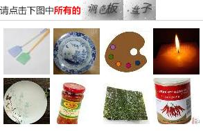
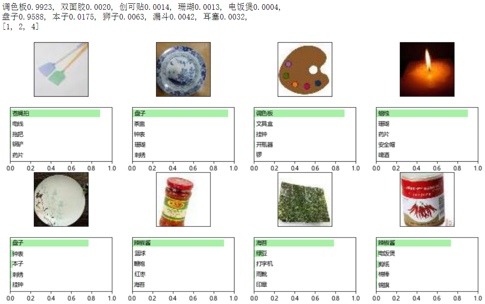

# Craking 12306
基于深度学习的12306登录验证码破解。单类别验证通过率约95%，双类别验证通过率约90%。



### Requirements
* tensorflow >= 2.1.0
* opencv
* numpy

如果需使用Jupyter进行可视化交互，还需要：
* matplotlib

如果需开启数据标注服务器，还需要：
* flask
* flask_compress

如果需自行进行训练，还需要：
* tqdm >= 4.43.0

### 文件结构
```
Cracking-12306/
├── bootstrap.py                        自举代码
├── Captcha-Interaction-Test.ipynb      与12306网站的交互识别
├── constants.py                        训练相关参数
├── h5/                                 最终模型
├── helpers/                            一些用到过的小工具代码
│   ├── generate_text_dataset.py
│   ├── generate_text_datasetV2.py
│   ├── generate_text_npz.py
│   ├── gen_imgtagger_html.py
│   ├── numeric.py                      *计算均值方差协方差并PCA
│   ├── original2real.py
│   ├── original_label.txt
│   ├── predict_need_tagged.py
│   ├── renamedir.py
│   ├── rename.py
│   ├── split_train_5fold.py            *将数据依类别等比例地划分为五份
│   ├── split_traintest.py
│   └── split_traintestV2.py
├── image_recognition_12306.ipynb       用于colab的部署，token已失效
├── metadata
│   ├── label_to_content.txt            类别名称与编号的映射
│   ├── test_label1.txt                 1号测试集
│   ├── test_label2.txt
│   ├── test_label3.txt
│   ├── test_label4.txt
│   ├── test_label5.txt
│   ├── train_label1.txt                1号训练集，内容为2345号测试集的并
│   ├── train_label2.txt
│   ├── train_label3.txt
│   ├── train_label4.txt
│   ├── train_label5.txt
├── models
│   ├── ResNet_SE.py                    SeNet的实现
│   ├── ResNetV2.py                     ResNet的实现（第二版）
│   └── ResNetV2_text.py                用于文字识别的ResNet
├── net
│   ├── fetch_images.py                 不断爬取图片，保存所有置信度较低的图
│   ├── image_retagger.py               图片类别标注Web服务器
│   └── templates/                      标注服务器相关html
│       ├── captcha_frame.html
│       └── index.html
├── test.py                             
├── test_single_img.py
├── text/                               文字识别模块相关
│   ├── net/                            网络相关，类似图片识别模块的net/
│   ├── text_image_exploring.ipynb      文字图片预处理的实验用notebook
│   └── textimg_preprocessing.ipynb
├── train.py                            训练图像分类模型
├── train_text.py                       训练文字识别模型
└── utils
    ├── data.py                         图像数据读取与Data Augmentation
    └── utils.py                        其他工具函数
```
## 使用
### 预测一张图片
请直接使用`./Captcha-Interaction-Test.ipynb`进行交互，相关接口调用方式也在其中。

### 训练图片分类器
请将数据保存在`archive/`目录下，每个类别一个目录，目录名称参阅`metadata/label_to_content.txt`。
```sh
$ python train.py
```

### 训练文字识别器
```sh
$ python train_text.py
```

## 验证码识别流程
首先在指定位置提取文字部分，如果是双类别，那么垂直边沿会有一个明显的突变，此处使用Y方向Sobel算子进行边缘检测，如果探测到边缘，说明是双类别图像，在边缘处进行切割；否则，视为单类别图像。由于单类别图像没有背景，因此探测有像素的最后一列并基于此裁剪。

将切割出的图片送给文字识别模型进行预测，得到预测结果。

切割验证码中的8个图片，送给图片分类模型进行预测，得到预测结果。

### 文字识别
由于文字输入大小不一，裁剪后统一缩放到57x57，使用双线性插值，交由模型进行预测。

### 图片预测
对于每一张图片，裁剪四个角与正中央指定大小的正方形区域，得到5张图，原图水平翻转后以同样的方法又得到5张图。于是一共有10张图片，将由5个不同的模型进行独立预测，最终得到50个预测值，求算术平均。

## 训练流程
由于图片数据集非常少，再分训练集与测试集非常难受，因此采用5-fold，训练集分为5份，训练5个不同的模型：1号模型使用第1份做测试集，其余做测试集，以此类推。每个模型独立训练，各自调参，最后进行继承。

5个模型中，主要包括ReNet与SeNet。